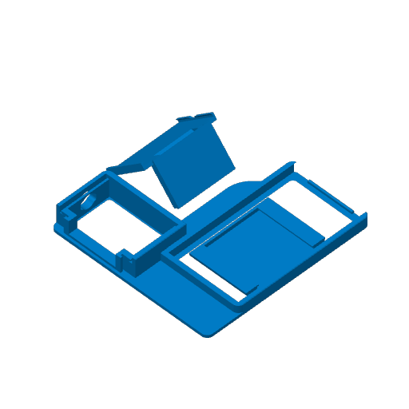
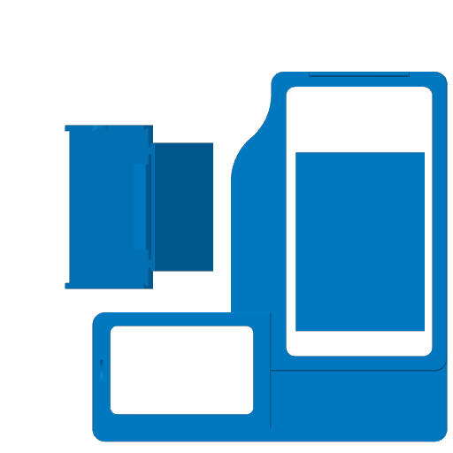

# FlashForge Creator 5 and Creator 5 Pro

 

**Print it from MakerWorld:
[TigerSpool for FlashForge Creator 5 and 5 Pro](https://makerworld.com/models/3361301-tigerspool-rfid-for-flashforge-creator-5-and-5-pro)**

A printer integration of the [desktop stand](../../0.Desktop/) for the
FlashForge Creator 5 and Creator 5 Pro: the same TigerSpool, in a case that
clips onto the printer's screen, with the TigerSpool screen and the reader
beside it - where the spools go into slots 1A to 1D.

## Recommended: the FlashForge × TigerSystem firmware

TigerSpool talks to the printer over your local network. With FlashForge's
standard firmware, **turning LAN mode on turns FlashForge Cloud off**. The
FlashForge × TigerSystem firmware - an official FlashForge build, developed by
their engineering team at TigerTag's request - keeps both on at once. It is
free.

| | Standard firmware | FlashForge × TigerSystem |
|---|---|---|
| FlashForge Cloud - app, remote access | ✓ | ✓ |
| LAN - local tools on your network | ✓ | ✓ |
| Both at the same time | ✕ | ✓ |
| Tiger Studio, Tiger NFC Connect and TigerSpool with Cloud on | ✕ | ✓ |

Download: [Creator 5](https://tigertag-project.github.io/FlashForge-TigerTag-Creator5-Firmware-Lan-and-Cloud/download/creator5/) ·
[Creator 5 Pro](https://tigertag-project.github.io/FlashForge-TigerTag-Creator5-Firmware-Lan-and-Cloud/download/creator5pro/).
It installs from a FAT32 USB drive, the file at its root, printer off; switch
on and it installs itself. Then turn LAN mode on. **Do not accept the printer's
own online update afterwards** - it puts the standard firmware back, and Cloud
+ LAN with it; reinstall from USB if it happened.

Thank you, FlashForge: opening a printer to an ecosystem that is not your own
is a rare decision.

## Parts

| Part | File |
|---|---|
| Frame | [`tigerspool-creator5-frame.3mf`](OriginalFiles/tigerspool-creator5-frame.3mf) |
| Cover | [`tigerspool-creator5-cover.3mf`](OriginalFiles/tigerspool-creator5-cover.3mf) |
| RFID reader holder | [`tigerspool-creator5-rfid.3mf`](OriginalFiles/tigerspool-creator5-rfid.3mf) |
| Everything, one plate (Bambu Studio) | [`tigerspool-creator5-full.3mf`](BambuStudio/tigerspool-creator5-full.3mf) |
| Everything, one plate (FlashForge's Flash Studio, for the Creator 5) | [`tigerspool-creator5-full.3mf`](FlashStudio/tigerspool-creator5-full.3mf) |

The bare parts carry geometry only, for any slicer; the two slicer projects
carry the orientation, the supports and the settings below.

## Print settings

| Setting | Bambu Studio | Flash Studio |
|---|---|---|
| Printer | A1 mini, 0.4 mm nozzle | Creator 5, 0.4 mm nozzle |
| Layer height | 0.20 mm | 0.08 mm |
| Walls | 3 | 2 |
| Infill | 15 % | 15 % |
| Supports | tree, placed by hand - they are in the project | the same |
| Material | PLA (Bambu PLA Basic in the project), two colours | PLA |

## Source

[`Source/tigerspool-creator5.f3d`](Source/tigerspool-creator5.f3d) - the Fusion design.
